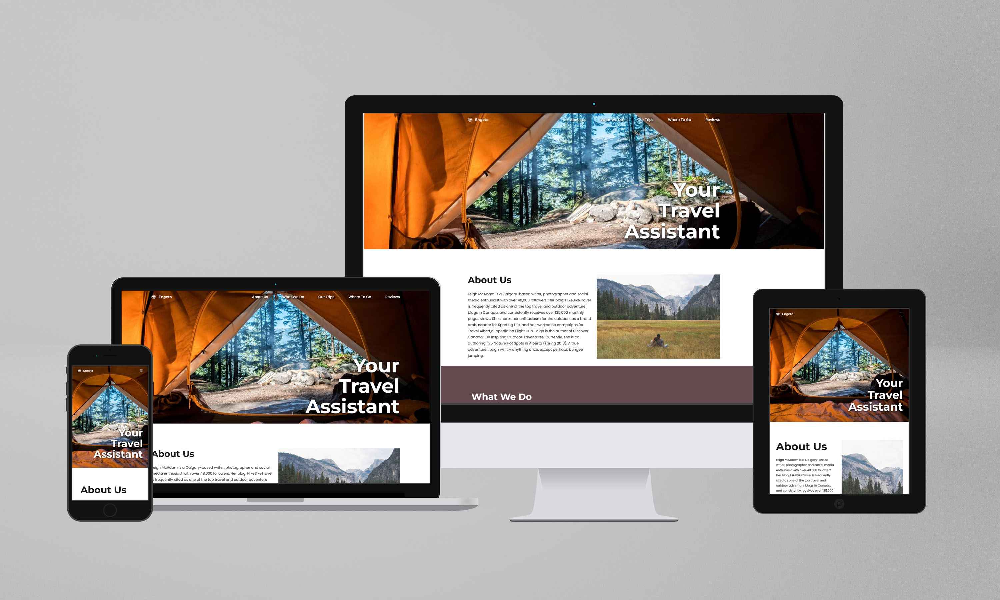

# Engeto Academy -project-1

Project #1 (HTML, CSS, JS) of Front-end developer Academy on Engeto.cz

This is a solution to the [Engeto Academy - Project 1](https://engeto.cz/webova-akademie/).

## Table of contents

- ➡️[Description](#description)
- ➡️[Screenshot](#screenshot)
- ➡️[Live Site URL](#live)
- ➡️[Author](#author)

## Description

This project was created as one of the three projects from the Engeto Academy - Front-end Developer course. The goal of this project is to imitate as faithfully as possible the visual design of a page titled "Your Travel Assistant." The main benefit of implementing this project is to practice media queries, which are used to adjust various cascading styles of the page based on the size of the device on which they are displayed, especially mobile phones, tablets, laptops, and large monitors.

## Specifications

🟢 “Mobile-first†approach 📲  
🟢 HTML, CSS, JS  
🟢 CSS Media Queries: <i>0-340px,340-480px,480-490px,490-768px,768px-1023px, 1023px-1152px</i>  
🟢 sticky navigation menu (show/hide) - only mobile devices 
🟢 using external JavaScript library for animating elements  

## Screenshot

## Live

- Live Site URL: ➡️ [www. petrb-engeto-academy-1.netlify.app/](https://petrb-engeto-academy-1.netlify.app) ⬅️

## Author

- Website - [Petr Bednarski](https://github.com/pettik)
- Frontend Mentor - [@pettik](https://www.frontendmentor.io/profile/pettik)
